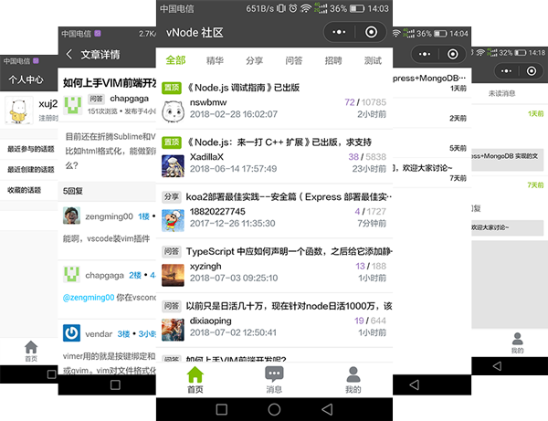

# vnode

> vnode是一款基于mpvue开发的CNode社区小程序，该小程序目的只为学习mpvue开发，不做任何商业用途

**预览**



## 下载启动步骤

``` bash
  git clone https://github.com/xuj2017/vNode.git

  cd vNode

  npm install

  npm run dev
```
### 注意事项

1. 项目需要在 [微信开发者工具中](https://mp.weixin.qq.com/debug/wxadoc/dev/devtools/download.html) 预览

2. 如果项目无法打开或者接口被拦截，可能需要你绑定`AppID`及在小程序`开发设置`->`服务器域名中`设置`request合法域名`

3. 如需在移动端预览，需绑定`AppID`,并开发者工具中，点击左侧“预览”，代码上传成功后会弹出一个二维码，打开微信扫码即可

4. 该小程序所用到的所有接口均来源于 [CNode社区](https://cnodejs.org/api)

5. 小程序在开发过程中部分样式及功能借鉴了[mpvue-code](https://github.com/jaxQin/mpvue-cnode)项目，感谢！！